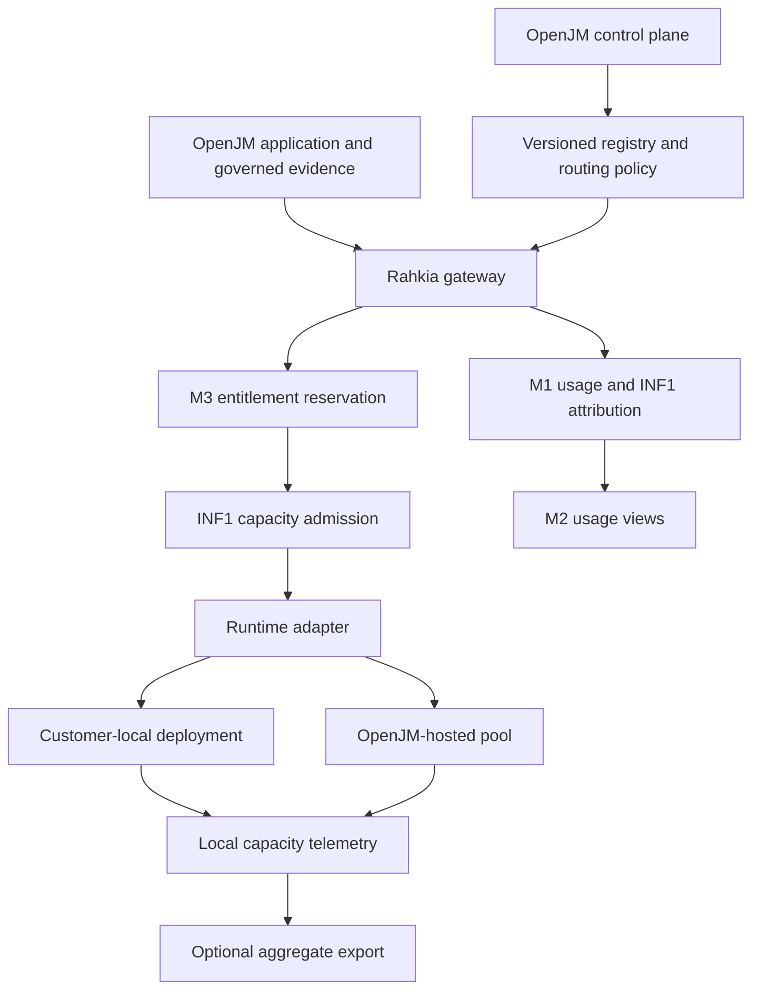

# INF1 — Rahkia inference serving plane

Status: architecture proposal for review; **not implemented or production-qualified**.
Prepared 2026-10-08 for [Issue #45](https://github.com/sjevans1/OpenJM-Enterprise-AI/issues/45#issuecomment-6064270657).
Metering/entitlements remain [Issue #46](https://github.com/sjevans1/OpenJM-Enterprise-AI/issues/46).

This package expands the agreed INF1 scope into implementation contracts. It does
not start the runtime work: the gate it waited on (BV3-C PostgreSQL acceptance and
integration of BV3-A/B/C) is now earned in `main` at `18cabaa2`, while the INF1
runtime start still requires an explicit authorization. See
[delivery and acceptance](../plan/INF1.md), the
[data and adapter contracts](INF1_CONTRACTS.md), and the
[executor handoff](../INF1_EXECUTION_PROMPT.md).

## 1. Product outcome and architecture decision

The same OpenJM application must use customer-local or OpenJM-hosted inference
without business features knowing which model server executes the request.
Rahkia is the stable OpenJM inference service contract and customer-facing
identity. A model release, serving engine, endpoint and deployment are distinct
identities underneath it. An OpenAI-compatible URL alone establishes neither
sovereignty nor tenant isolation.

Implement Rahkia first as an internal Python service behind the existing model
gateway. Keep an interface that can later cross a service boundary. A separate
gateway microservice, Kubernetes, autoscaling, fine-tuning and a new public
OpenAI-compatible API are not prerequisites for INF1-A.

The diagram describes the target. M3 and INF1-B admission are later gates, not
existing capabilities. Evidence authorization stays in the application before
model context is constructed. Neither routing nor an entitlement grants access
to a document, table, report, tool or customer conversation.

## 2. Four deployment modes, one application contract

| Mode | Inference location and hardware | Operations | Content and usage boundary |
| --- | --- | --- | --- |
| `customer_local` | Customer site; customer hardware | Customer operates a qualified runtime | Prompts, evidence, responses and detailed ledger stay at the site; optional aggregate export |
| `openjm_managed_local` | Customer site; customer hardware | OpenJM operates with explicitly granted management access | Same local content boundary; remote management is separate from content access and telemetry consent |
| `openjm_hosted_dedicated` | Approved OpenJM site; customer-assigned runtime/pool | OpenJM | Inference content reaches the approved hosting boundary; dedicated runtime and capacity assignment recorded |
| `openjm_hosted_shared` | Approved OpenJM site; governed shared pool | OpenJM | Explicit tenant binding, admission and runtime isolation qualification required before activation |

These inference modes are independent of `OPENJM_DEPLOYMENT_PROFILE`
(`development` or `production`) and of where the application itself runs. They
extend, rather than replace, the accepted [VS8 deployment profiles](../DEPLOYMENT_PROFILES.md).
Record the application installation and actual inference site separately. An
application at the customer site calling OpenJM hosting is not local inference.
A loopback proxy to an external model is not proof of local execution.

For sovereign installations, allowed execution sites and data classes are an
explicit policy. Local-to-hosted failover is off. All four modes default to no
third-party model execution. A future external API adapter is a reserved
extension requiring deployment-specific approval and a separate egress policy;
it is not enabled by this design or required for acceptance.

## 3. Who controls what

| Plane / actor | Intended controls | Boundary |
| --- | --- | --- |
| OpenJM platform operator | Register qualified models/runtimes/deployments, bind approved routes, inspect health/capacity and aggregate usage | Explicit platform capabilities; metadata authority does not grant content support |
| Client admin | See own usage/plan, service availability and approved data-location summary; manage allowed business settings | Cannot set endpoints, credentials, arbitrary models, cache identifiers or other tenants' routes |
| Data steward | Govern source access and classification | Does not administer inference machinery by virtue of stewardship |
| End user | Chat and authorized tools; clear service/limit errors | Does not select a raw runtime or need to understand GPU/queue internals |

Use the accepted BV3 capability axis. INF1-A proposes a new, explicit
`platform:inference:admin` capability for registry and binding mutations, absent
from automatic tiers and bootstrap. Reuse `platform:metadata:read` for bounded,
redacted registry metadata reads. Additive migration must widen capability
constraints without editing historical migration literals. Check capabilities
at route and service boundaries; audit successful and denied privileged
operations using bounded reason codes.

An inference administrator can redirect where future content is processed, so
this is sensitive authority even though its API does not return content. Require
an approved site/egress policy, server-side secret references and a reviewed
activation step. Customer-local policies cannot be widened by a routine health
fallback or endpoint edit. Credential rotation preserves deployment identity
but increments its configuration revision.

## 4. Request path

1. Authenticate and resolve the tenant and actor from trusted server context.
   Authorize the requested product operation and every evidence source.
2. Mint a parent business-request ID, logical model-call ID and per-attempt ID.
   Resolve an approved Rahkia model alias to a pinned model release.
3. Evaluate the tenant binding against capability, residency, sensitivity,
   deployment ownership, lifecycle, runtime qualification and policy revision.
   Persist a content-free allowed/denied routing decision.
4. In INF1-B/M3, obtain a commercial reservation and a bounded queue ticket.
   Acquire an atomic capacity lease immediately before dispatch. Recheck current
   tenant status, policy and reservation validity after waiting. No SQL
   transaction or row lock remains open during a queue wait or model call.
5. Persist dispatch intent, call the adapter once, enforce deadline and output
   limits, and preserve the existing output-validation behavior.
6. Finalize the M1 token event and immutable deployment attribution. Record
   normalized telemetry; retain a recoverable pending state if settlement fails.
   Settle credits using actual known usage and release capacity safely.
7. Return the validated answer and existing authorized evidence contract.

Reauthorization after waiting must cover evidence revocation as well as tenant
status; a source-policy revision change requires rebuilding authorized context
or denying dispatch. Do not let a queued prompt carry revoked evidence onward.

Retries are real attempts. The gateway owns their total budget; adapters do not
retry invisibly. Preserve the existing one malformed-output retry in INF1-A.
Cross-deployment fallback remains disabled in A. B may add explicit approved
fallbacks only after reauthorization, fresh admission and remaining-budget checks.
Never automatically replay an attempt after bytes were sent when completion is
unknown, or after any streaming output reached the caller.

## 5. Tenant isolation below the application

Routing must intersect tenant bindings with site, model, capability and security
requirements before health or cost preferences. A healthy unauthorized worker
is never a candidate. Missing, empty, revoked or stale authority denies; it never
means unrestricted access. A dedicated deployment has exactly one tenant owner.
Shared mode requires explicit bindings; there is no wildcard tenant grant.

Only the gateway can reach runtime generation endpoints. Runtime management,
metrics, model loading, cache control and worker ports stay on the operations
network. Use authenticated encrypted transport across hosts; any local cleartext
exception is limited to a reviewed loopback/isolated local network deployment.
No endpoint, URL, header, credential, runtime option or cache namespace comes
from Chat input. Endpoint registration must enforce operator-managed site and
destination allowlists, reject embedded credentials and redirects, and prevent
DNS/destination changes from escaping the approved network. Do not blanket-ban
private addresses: approved on-prem destinations are essential to this product.

For prompt-derived caches, default to disabled reuse or a runtime dedicated to
the required trust boundary. Tenant-level separation is the minimum: HR and
ordinary staff within one tenant may require separate authorization domains.
Gateway-generated cache identities must reflect that boundary, model release
and authorization-policy epoch, and must not be user-controlled or predictable.
Do not export them. Apply the same policy to multimodal caches, CPU/disk offload,
distributed KV stores and response caches. Do not add response caching in A.

**Shared serving is a target mode, not an automatic production claim.** vLLM's
security documentation states that callers sharing a server process are not
tenant-isolated; cache salting only mitigates particular cache risks. Therefore
shared activation needs INF1-B threat-model and deployment qualification. Where
the isolation requirement cannot be met, use separate runtime instances and,
where required, dedicated accelerators. Disabling prefix reuse alone is not a
proof of full isolation. See the primary sources below.

## 6. Commercial admission versus capacity admission

M3 owns the credit/allowance ledger, plan version, reservation, grace and warning
policy. INF1 owns bounded waiting, concurrent work, worker capacity and runtime
leases. One orchestrated dispatch links both IDs; neither layer duplicates the
other's ledger. INF1 must never infer entitlement from a tenant role or from a
successful route lookup.

| Failure boundary | Required handling |
| --- | --- |
| Authorization, route or entitlement refusal | No runtime call; no consumed-token event; retain a content-free decision |
| Queue full or deadline before dispatch | Release unused commercial hold exactly once; no token charge |
| Crash before dispatch | Recover from durable intent; release only after establishing that dispatch did not occur |
| Timeout/cancel after dispatch | Consumption may be unknown; retain settlement obligation and prevent unsafe replay |
| Runtime completed; database/settlement unavailable | Preserve durable consumption evidence and retry finalization idempotently; new hard-cap calls fail closed if accounting safety is unavailable |
| Duplicate callback or finalizer | Same attempt yields one usage event and one settlement |
| Worker continues after lease expiry | Quarantine/reconcile worker capacity; lease expiry does not prove execution stopped |

Do not claim exactly-once model execution over HTTP. The achievable guarantee is
idempotent accounting per observed attempt plus explicit recovery of uncertain
execution. Cancellation support and worker termination acknowledgement must be
qualified for each adapter. Uncertainty is not zero usage.

## 7. Local monitoring and disconnected operation

Detailed token and operational records remain local in the two local modes.
OpenJM can monitor a connected customer installation through **opt-in aggregate
export**, separate from remote support authority. Default export policy is
`off`. An air-gapped installation uses the same local meter, registry and
admission logic, and can optionally reconcile signed aggregate bundles by a
customer-approved transfer process.

The export is built from a strict allowlist, not a redaction pass over full
requests. It contains installation/export identity, approved commercial tenant
reference, reporting window, public model alias, deployment mode, counters,
measurement-quality splits and coarse latency/capacity summaries. Never include
prompts, responses, retrieved text, content hashes, filenames, table names,
principal/conversation/request IDs, internal hostnames, credentials, raw errors
or cache keys. Reject unexpected fields. Aggregation reduces content exposure;
account-level usage is still commercial metadata, not anonymous information.

Use fixed, non-overlapping UTC windows plus the agreed billing-period timezone.
Retries resend the same signed export ID and payload digest. Import is
idempotent per installation/export ID, rejects conflicting replays, checks
sequence gaps and records acknowledgements. Late data uses explicit correction
bundles referencing the prior window; it never silently replaces history.
An unavailable collector must not stop local inference; local storage pressure
uses explicit retention/backpressure policy and must not discard unsettled usage.

Offline M3 entitlement packages are signed, installation/tenant-bound, versioned
and time/allowance-bounded, with imported top-ups deduplicated. Persist the
accepted sequence and consumption locally; reject expired or older packages and
detect clock rollback where possible. The grace period, allowance and export
cadence are customer-plan configuration, not constants invented here. A client
with root access can alter software, clocks or restored state: a signature alone
cannot provide tamper-proof offline billing. Stronger guarantees require an
explicit trusted-hardware/reconciliation/contractual model. Commercial launch
must document that trust assumption.

## 8. Metrics and GPU economics

M1 remains authoritative for raw application token usage. INF1 observations are
separate from pricing and distinguish measured, estimated, allocated and unknown
values. A buffered HTTP completion does not reveal TTFT; record it as unknown
unless a qualified runtime provides a correlated measurement. Runtime aggregate
histograms cannot be relabelled as a particular request's latency.

Collect queue time, service latency, TTFT where known, output throughput, retries,
failures and pool utilization. Record physical GPU/pool identity, accelerator
count, tensor/pipeline parallel configuration and model revision internally.
Define GPU-seconds as measured active time or explicitly allocated GPU-time;
never treat request wall-clock seconds multiplied by GPU count as actual GPU
consumption under continuous batching. INF1-C must conserve totals within each
pool/window, retain unattributed/idle capacity, record counter resets, and avoid
summing duplicate scrapes or overlapping allocation methods.

Wholesale cost, power/hosting assumptions and internal margin belong to the
OpenJM operator plane. Customer token/credit charges derive from versioned M3/M4
policy and never from silently changing GPU-cost estimates. No GPU count, model
choice, throughput promise or SLA is selected without a pinned hardware/model
benchmark and workload profile.

## 9. Code reconciliation and migration approach

Inspected accepted main `8626f422a663ce238157a4023df23b9a5ed43c96` when this proposal was prepared; the
current integrated baseline is `18cabaa2d03faace8dac69b0b62a143e5e629125` with BV3-A/B/C merged:

| Existing seam | Observation | INF1 treatment |
| --- | --- | --- |
| `backend/app/services/model_gateway.py` | One configured endpoint/model; buffered requests; bounded malformed-output retry; safe provider errors | Keep `chat(...)` compatibility; route each actual attempt through a Rahkia service/adapter |
| `backend/app/services/usage_metering.py` | M1 token normalization; SAVEPOINT-based idempotency; caller transaction and pending failure recovery | Reuse raw ledger; add attribution without rewriting historical rows |
| `backend/app/models.py::ModelUsageEvent` | Provider route/model name; no deployment identity | Add a one-to-one immutable attribution sidecar keyed to the usage event; legacy rows remain explicitly unattributed |
| `backend/app/core/usage.py` | `provider_reported` / `estimated`; coarse character estimator | Preserve enum; record tokenizer/count method separately; do not relabel estimates as provider counts |
| `backend/app/core/config.py` | `local` / `private_remote`; production fallback `none` | Explicit legacy bootstrap binding; no wildcard import or silent fallback enablement |
| BV3 APIs (PRs #52–#54, now integrated) | Platform/client authority separation, merged in `main` at `18cabaa2` | Re-read the integrated code before adding registry APIs or allocating migration IDs |

Two commercial risks need explicit acceptance coverage: current metering failure
is tolerated by the gateway; current idempotency uses request/role/attempt and
must distinguish multiple logical model calls within one business request.
Test the actual caller graph before changing keys. INF1-A specifies and records
the identities; INF1-B/M3 must prove durable dispatch/settlement under crashes.
Do not quietly rewrite or expand M1 in an unrelated schema migration.

Keep migrations additive. Serialize edits to `models.py`, capability vocabulary,
usage context and the migration chain with M2. Do not reserve a numeric revision
before rebasing on the integrated head. Registry records are disabled/tombstoned,
not destructively deleted while referenced. Backups include registry revisions,
usage attribution and local entitlement/export state; secrets remain in the
existing protected secret mechanism. Old usage is not backfilled with guessed
deployment or GPU identities.

## 10. Runtime qualification sources

Primary documentation inspected 2026-10-08; implementation must pin and retest
the chosen release, not assume the rolling docs describe the installed binary.

- [vLLM security and multi-tenant limitations](https://docs.vllm.ai/en/latest/usage/security/).
- [vLLM prefix caching](https://docs.vllm.ai/en/latest/design/prefix_caching/).
- [vLLM production metrics](https://docs.vllm.ai/en/stable/usage/metrics/).
- [SGLang OpenAI-compatible APIs](https://docs.sglang.io/docs/basic_usage/openai_api).
- [SGLang production metrics](https://docs.sglang.io/docs/references/production_metrics).

These sources establish runtime integration surfaces and limitations. Routing,
commercial admission, privacy defaults and acceptance gates above are OpenJM
design decisions, not claims of automatic runtime guarantees.
