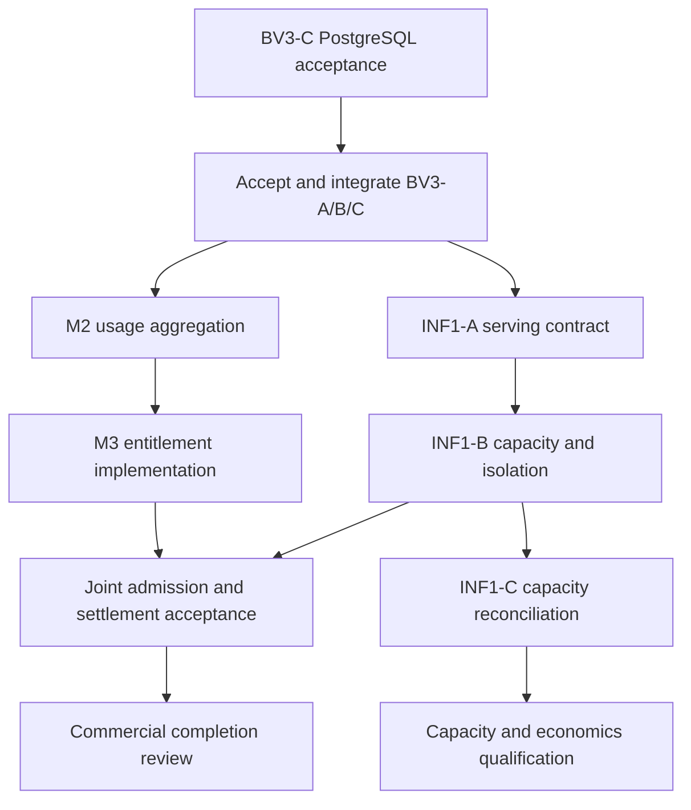

# INF1 delivery plan and acceptance gates

Status: **architecture prepared; runtime implementation blocked by the agreed BV3 gate**.
Authority: [Issue #45 INF1 decision](https://github.com/sjevans1/OpenJM-Enterprise-AI/issues/45#issuecomment-6064270657),
with commercial work under [Issue #46](https://github.com/sjevans1/OpenJM-Enterprise-AI/issues/46).

Read the [architecture](../architecture/INF1_RAHKIA_SERVING_PLANE.md),
[contract specification](../architecture/INF1_CONTRACTS.md) and
[executor handoff](../INF1_EXECUTION_PROMPT.md). These documents are a reviewable
proposal implementing the accepted direction; approval of this documentation
does not mean any runtime acceptance case passed.

## Inspected baseline — 2026-10-08

| Item | Observed state |
| --- | --- |
| Accepted `main` | `8626f422a663ce238157a4023df23b9a5ed43c96`; BV1/BV2/M1 foundations |
| BV3-A | [PR #52](https://github.com/sjevans1/OpenJM-Enterprise-AI/pull/52), draft/open, head `24d184df8fe27f4eea52d402da6d8a01dad10616` |
| BV3-B | [PR #53](https://github.com/sjevans1/OpenJM-Enterprise-AI/pull/53), draft/open, head `d8b88626751abcc8a323bded96e5ac7482e7c385` |
| BV3-C | [PR #54](https://github.com/sjevans1/OpenJM-Enterprise-AI/pull/54), draft/open, head `f05610b60941b31f4d9dece8640c3eeb7ed4bcce` |
| INF1 implementation | Not started by this package; BV3 integration is not complete |

This is a dated observation, not a live status service. Refresh the exact heads,
PostgreSQL evidence and merged-main state before starting code. An older passing
run or an older freeze comment cannot accept a changed head.

## Required sequence

Architecture preparation may be reviewed now. Runtime/schema changes begin
only after BV3 is accepted/integrated and its required main regression is green.
Do not merge BV3 or this package without Shane's explicit approval. Coordinate
M2's read-only aggregation with A's attribution work; serialize changes to the
same schema, usage-context or admin contract. Parallel work does not authorize
competing migration heads or hidden integration debt.

Commercial readiness applies to the deployment modes being released. Shared
mode stays unavailable until its isolation gate is earned; this does not force
a qualified local/dedicated deployment to launch shared serving. C qualifies
capacity/economics and export claims; do not invent a new all-mode launch gate
or call unfinished C features delivered.

## INF1-A — Registry, adapter and attribution

One bounded implementation PR, split only if review size warrants it. Start from
fresh integrated `main`; preserve `OpenAICompatibleModelGateway.chat(...)` for
Chat, planning and reports.

Deliver:

1. Versioned model/runtime/deployment/binding records and operator-only registry
   service/API, including an explicit inference-administration capability.
2. Typed internal request/result/health/route contracts and one common
   OpenAI-compatible transport with local/private-hosted profiles. No engine SDK
   dependency in business features.
3. Deterministic, fail-closed routing with tenant/site/model/capability/health
   checks and immutable, content-free decisions.
4. Per-call/per-attempt identity and a one-to-one M1 attribution sidecar; preserve
   historical ledger keys and totals. Test actual multi-call callers.
5. Token/timing normalization, null/quality semantics and a pure aggregate
   export serializer. No outbound exporter or entitlement implementation.
6. Explicit legacy configuration bootstrap and additive SQLite/PostgreSQL
   migrations with rollback notes.

Before editing, reconcile at least: `app/services/model_gateway.py`,
`app/services/usage_metering.py`, `app/core/usage.py`, `app/core/platform.py`,
`app/core/config.py`, `app/models.py`, the integrated BV3 platform APIs,
Chat/orchestrator/structured-planner/report-run call sites and accepted preflight
rules. Proposed new seams are `app/core/inference.py` and
`app/services/inference/`; choose file structure to fit current code, not a new
framework. Allocate migration IDs only after inspecting the current chain.

A excludes queueing, autoscaling, GPU scheduling, billing UI, token-price
conversion, runtime installation, real GPU benchmarks, model training and
Workspace changes. It records shared topology but cannot activate unqualified
shared deployments. No new generation modalities, public API or implicit
execution-mode routing.

### A acceptance matrix

| ID | Required proof |
| --- | --- |
| A01 | Identical application call and Rahkia alias work with isolated local and hosted fake transports; business caller and response shape unchanged |
| A02 | Tenant A cannot select, enumerate or infer tenant B's dedicated deployment; caller-supplied tenant/deployment/cache/endpoint fields cannot override server context |
| A03 | Missing/revoked bindings, suspended tenants, disabled/draining deployments, wrong sites, stale health and unsupported capabilities deny before any network call |
| A04 | Sovereign/local policy cannot fall back to hosted or an external API on outage; no wildcard bootstrap binding |
| A05 | Routing records pin model/runtime/deployment/binding revisions; revocation or policy change blocks next dispatch |
| A06 | Each actual primary/retry/planner/synthesis/report invocation records M1 usage plus matching attribution; two logical calls under one request remain distinct |
| A07 | Duplicate/racing finalization produces one event/sidecar and preserves unrelated caller transaction state; cross-tenant/idempotency conflict fails closed |
| A08 | Failed/malformed/partial responses retain available usage and lineage; safe errors contain no content, private address or credential; uncertain execution is not reported as confirmed zero |
| A09 | Strict token normalization rejects booleans/negative/malformed counters; cached/reasoning tokens are not double-added; unavailable TTFT/GPU metrics are null |
| A10 | Serializer rejects extra fields including prompt/response/content hashes and principal/request IDs; export policy defaults off; no network export is invoked |
| A11 | Tenant owner/admin and ordinary platform metadata readers cannot mutate registry; explicit operator can; authorization and audit cover each mutation |
| A12 | Additive upgrade from populated pre-INF1 schema succeeds on SQLite and PostgreSQL; legacy ledger unchanged; registry/sidecars survive restore and safe application rollback |
| A13 | Accepted Chat/Knowledge/Data/Hybrid/report semantics, source authorization and one malformed-output retry remain intact |
| A14 | Qualified real local and private-hosted smoke checks identify actual engine/model versions and sites, preserve attribution, and exercise provider failure without content leakage |

A01–A13 are automated where practical; security cases require RED→GREEN
evidence before UI/API wiring. A14 is a separate controlled runtime gate.
Protocol fixtures alone can establish an adapter contract, not vLLM/SGLang
performance, hardware suitability or production multi-tenant isolation. If real
runtime access is unavailable, report A14 NOT RUN and limit the acceptance claim
to the contract foundation.

## M2 interface agreement

M2 aggregates immutable M1 counts with optional one-to-one attribution. Use a
left join for legacy rows; never drop unattributed usage or multiply totals via
one-to-many telemetry observations. Group unattributed history explicitly as
`legacy_unknown`. Keep provider-reported, estimated and uncertain coverage
separate. M2 owns bounded tenant/day/month queries and admin visibility; A owns
registry and attribution writes. Exporting usage to a client admin is separate
from sending local installation telemetry upstream to OpenJM.

Agree the business-request/logical-call/attempt mapping before either lane
freezes. M2 may land without deployment grouping if A has not landed, but must
not synthesize deployment identity from a provider URL/name. No shared edit of
`/api/admin/usage` while another lane changes its shape without reconciliation.

## INF1-B — Admission, concurrency and isolation

Prerequisites: accepted A contracts; M3 reservation interface agreed before
implementation. Deliver atomic tenant and deployment capacity limits across
multiple API workers, bounded fair queues, maximum request/output sizes,
deadlines/cancellation, durable leases/dispatch intent, explicit overload
responses, approved retry/fallback behavior and dedicated/shared cache policy.
An in-process semaphore alone is insufficient for multi-worker production.
The mechanism may use the existing transactional database; no Redis/Kubernetes
dependency is assumed or required by this plan.

M3 reserves a worst-case bounded commercial amount using its versioned policy;
INF1 requests no credit value of its own. Queue admission occurs only after a
valid entitlement reservation. Failed enqueue releases the hold. Before actual
dispatch acquire capacity, validate/renew the hold within the same request
deadline, and reauthorize. No long-lived database locks across network execution.
This is a recoverable state machine, not a distributed-transaction claim.

| ID | Required proof |
| --- | --- |
| B01 | Simultaneous requests across two API processes cannot exceed tenant/pool concurrency; leases are fenced and cannot be reused |
| B02 | Queue length/wait bounded; fair policy prevents one tenant starving another; overload returns a safe retry indication without unbounded retries |
| B03 | Queued tenant/source/binding revocation prevents dispatch; existing saved conversations and usage/admin recovery remain readable when credits run out |
| B04 | M3 hard cap holds under concurrency; queue rejection and pre-dispatch cancellation release once; completed usage settles once |
| B05 | Crash tests at reservation, enqueue, dispatch, response and settlement boundaries recover without duplicate accounting or unsafe replay; uncertain consumption remains explicit |
| B06 | Expired capacity lease cannot overbook a still-running worker; cancellation acknowledgement or quarantine/reconciliation establishes capacity release |
| B07 | Dedicated tenant cannot be placed in shared pool; no cross-tenant prompt-derived cache reuse; client cannot select another namespace; source-policy epoch isolates revoked content |
| B08 | Pinned engine/deployment security tests include cache/offload/management-network boundaries; unqualified shared mode remains disabled |
| B09 | Retry/fallback uses remaining deadline/output/credit budget and a newly admitted attempt; local sovereignty never widens; post-send uncertainty is not replayed |
| B10 | Local and disconnected deployments enforce entitlements without a cloud call; expired/replayed top-ups and older entitlement packages rejected; trust limits documented |

Use a committed clean baseline for mutation tests. Never revert uncommitted
implementation work. Capture mutations as isolated committed changes/worktrees,
preserve the accepted base, and use targeted negative tests. Stop a lane after
two unexplained correction cycles; preserve its evidence and blocker.

## INF1-C — Capacity telemetry and reconciliation

Prerequisites: accepted A attribution and B isolation/admission. Deliver pinned
runtime metrics ingestion, bounded-cardinality operational APIs/dashboards,
pool-window capacity accounting, attempt correlation where supported, and the
opt-in aggregate exporter/importer. Keep internal cost assumptions separate from
customer pricing and account-scoped M2 usage views.

| ID | Required proof |
| --- | --- |
| C01 | Token totals reconcile to M1; legacy/unknown coverage explicit; no duplicate totals from joins, retries, collector restarts or export replay |
| C02 | Pool GPU-time allocation conserves measured/allocated totals, keeps idle/unattributed time and handles counters resetting; estimates clearly labelled |
| C03 | Request measurements and pool histograms retain different scopes; buffered results do not invent TTFT; utilization windows identify missing samples |
| C04 | Export off means no upstream network request; aggregate-only tests reject sensitive fields at every nesting level; collector outage leaves local inference functional |
| C05 | Signed offline/online bundle import rejects tampering/conflicting replay, deduplicates identical replay, records gaps/acknowledgements and applies explicit corrections |
| C06 | Platform operator sees authorized fleet metadata/cost; client admin sees only own approved usage/service summary; no secrets or wholesale cost in customer responses |
| C07 | Backup/restore preserves unsettled reservations, attribution and export sequence; restored installations cannot silently duplicate credits or historical exports |
| C08 | Pinned hardware/model workload run records concurrency, context/output mix, latency percentiles, throughput and memory/accelerator utilization before any SLA/capacity claim |

## Decisions and release evidence

The current direction resolves the architecture: four modes, Rahkia contract,
replaceable engines, strict tenancy, default-local detailed usage, opt-in
aggregates, offline operation, no automatic external fallback. No business
clarification blocks this architecture package.

Before qualifying a real deployment, obtain its exact hardware/model/runtime
version, approved application/inference sites, data policy, performance target,
management authority, telemetry agreement and offline entitlement/grace terms.
These are deployment configuration and contract inputs, not reasons to invent
global defaults or block the synthetic A contract work.

Each code PR handoff must include exact head/base SHAs, migration chain, focused
tests, required fast/full CI run IDs for that head, PostgreSQL evidence, actual
runtime evidence where required, NOT RUN items and known limitations. Commit
before the final gate; publish evidence in the PR without another evidence-only
commit that invalidates the checked head. Use CI for broad regression and inspect
failures; do not repeatedly rerun already-green suites.

This documentation package runs only document/link/example checks. It does not
claim A/B/C acceptance, GPU tests, M2/M3 completion, deployment or commercial
readiness. Nothing in INF1 changes Workspace, source access semantics, the
explicit execution-mode selector, invoice/tax/payment processing or accepted
VS1–VS8 history.
