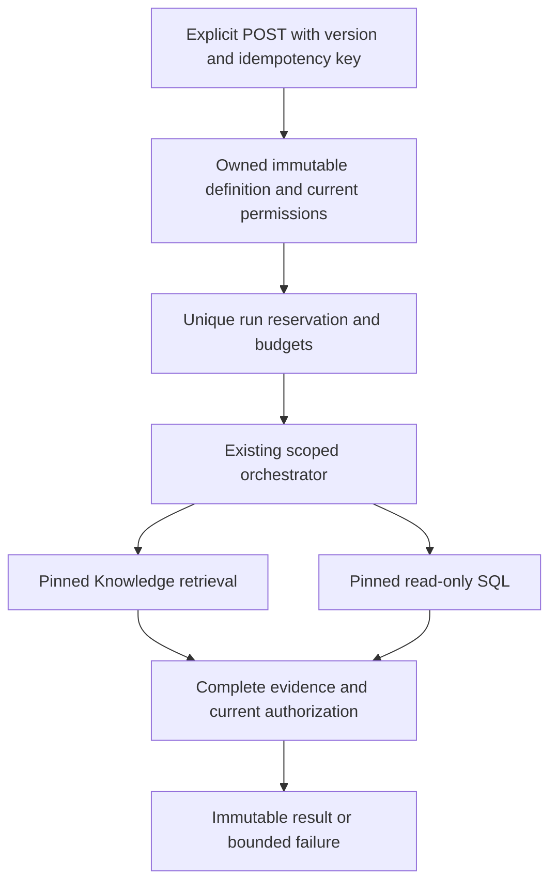

# VS4-B2C2 — Explicit scoped execution and immutable results

Tracker: [#23](https://github.com/sjevans1/OpenJM-Enterprise-AI/issues/23), #19.
Branch: `milestone/vs4-b2c2-manual-execution`. One PR. Depends on accepted B2C1.

## Intended path

## Phases and acceptance

1. **Explicit submission.** Add POST
   `/api/reports/{report_id}/definitions/{version}/runs` with a strict body
   containing only `idempotency_key`. No client question, pins, SQL, identity,
   model, answer or other extra fields. Unknown/wrong owner is 404; mismatched
   idempotency intent is 409; malformed body is 422. Preserve B2C1 reservation
   semantics. Replays still reauthorize the response and never rerun tools.
2. **Governed execution.** Load `load_validated_definition_scope`, revalidate all
   pins immediately before external work and use `OpenJMOrchestrator.plan` with
   its exact question/mode/scope. Reuse existing tools/model gateway; no second
   query engine, saved SQL replay or broad-source fallback. Revalidate before
   delivering/persisting a successful result. Preserve execution-time tool checks.
3. **Complete results only.** Knowledge needs authorized document Evidence;
   Data needs actual bounded structured Evidence; Hybrid needs both, including
   independent and policy-dependent cases. A refusal, failed tool, empty required
   evidence, or partial Hybrid is not success. Dependent Hybrid freshly derives
   policy threshold/operator/year/currency from current pinned documents and
   passes existing AST/grounded-parameter equivalence checks. Bind safe trace IDs
   to this run without inventing a Chat conversation or modifying old messages.
4. **Result and budget enforcement.** Persist actual answer, Evidence, definition
   version, timestamps and safe typed structured rows/columns from executed tool
   output (when present). Do not parse a narrative or preview passage back into
   data for future CSV. Apply B2C1 byte/row bounds. One run per definition may be
   active at a time; excess different-key requests return a bounded conflict.
   Per-run wall budget <=600 seconds, <=8 model HTTP attempts including retries,
   <=2,048 output tokens per model request, <=2 governed SQL executions and <=2
   Knowledge retrieval calls. Preserve stricter existing per-call SQL/model
   timeouts and source row limits. Scope budgets to this report run; ordinary
   Chat behavior must remain unchanged. Exceeding any budget is a terminal
   failure with no automatic fresh-key retry. If the current interfaces cannot
   enforce a bound without an architectural change, raise a plan-change issue.
5. **Fail-closed release gate.** Put submission behind
   `OPENJM_REPORT_RUNS_ENABLED=false` by default. With it off, POST is unavailable
   and definitions report not runnable; viewing history is still read-only.
   Tests and the isolated acceptance instance may explicitly enable it. Do not
   enable on an existing development/production instance as part of this PR.
   Default activation after acceptance is a separate operator decision, not a
   change Hermes may infer. No background worker, scheduling or auto-run on read.

## Required tests before review

Use focused report-run tests plus existing B2A/B2B/VS3 suites. Prove concurrent
identical submission invokes external work once, restart/timeout cannot replay,
and terminal results/snapshots stay unchanged. Prove wrong-owner, unpinned docs,
equivalent-source tampering, disabled sources, revoked table grants, schema/CTE
ambiguity, hostile/missing/contradictory policy, partial Hybrid and oversized
results fail closed. Revoke access during an in-flight test: no resulting answer
or data may be delivered. No source DB writes or credential/URI/error leakage.

Final-head fast PR + full hosted CI are required. Add a reproducible
`scripts/report_runs_acceptance.py` for the new API, with CLI help, isolation
preflight, unique fixture IDs, test-owned cleanup and nonzero exit on a failed
assertion. Execute it in WSL against real Gemma/DB-GPT/Chroma and a temporary
read-only SQLite data source. Cover Knowledge, Data, independent/dependent
Hybrid, duplicate submission, revocation and immutable earlier results. Preserve
old app DB, vectors, uploads and credentials; use separate metadata/vector/upload/
key paths and an unused test API port. Do not hardcode or commandeer Workspace
ports. Record actual commands and code SHA, not an invented expected transcript.

Missing local runtime means awaiting_local_verification, not ready for review.
No UI implementation here; C1 consumes the verified API. Stop at awaiting_review.
